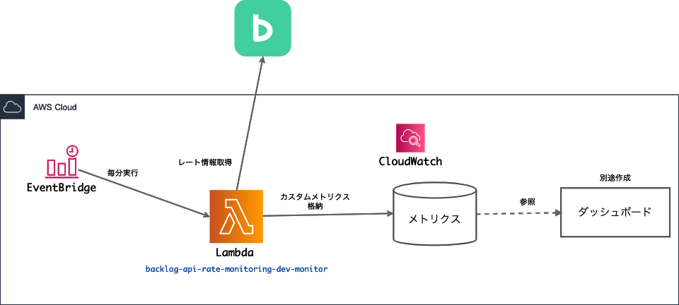

# Backlog APIレート 監視

## 構成


## 仕様
- 調査したいBacklogユーザーのAPIキーを使い、レート制限情報の取得APIを定期実行して利用状況を把握する
    - https://developer.nulab.com/ja/docs/backlog/api/2/get-rate-limit/#
- 取得した情報はCloudWatchメトリクスにカスタムメトリクスとして値を格納し、ダッシュボードでグラフを参照できるようにする。
- 上記構成図の通り、Lambda + Eventbridgeで構成。
- 取得頻度は **約5秒**
    - Lambdaは1分毎に実行される。コード内で5秒置きに取得するように実装。
- 値の精度
    - Lambdaの重複実行に対する冪等な実装はしていない。
    - レート制限情報を取得する時間とメトリクスを作成する時間同じになるよう実装していないため、ms単位での誤差がある。
    - 以上のように **完全に正確な値であるとは保証されないが、利用状況の傾向や大幅なリクエスト増加を見る前提で、この精度で十分であると判断する。**
-  **このレート情報取得自体にreadが使われるため、readの値にはその分が上乗せされたで状態で集計される**

### メトリクス仕様
Namespace : BacklogApiRate

|メトリクス名|説明|
|---|---|
| Limit | 制限数|
| Remaining | 制限残数 (残り利用可能なリクエスト数)|
| Usage |利用数。Limit - Remaining|

|ディメンション|説明|
|---|---|
| ApiKey | 対象のAPIキーの先頭5文字 |
| ApiType | 対象のAPI種別。read = 読み込み , update = 更新 , search = 検索 , icon = アイコン。 [詳細](https://developer.nulab.com/ja/docs/backlog/rate-limit/#) |

## 環境
- Python3.8
- Node.js v14.7
  - Serverless framework

## デプロイ
Serverless frameworkを使ってデプロイする (あらかじめ環境にインストールしておく)

Serverless frameworkのプラグインインストール (初回のみ)

```
npm install
```

デプロイ

```
sls deploy --backlog_space_key {BacklogスペースID} --backlog_api_key_list {Backlogキー (カンマ区切り)} --aws-profile {AWSプロファイル名}
```

## デプロイ後
適宜、ダッシュボードやアラートを作成し、状況を監視する。
